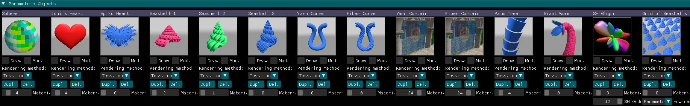
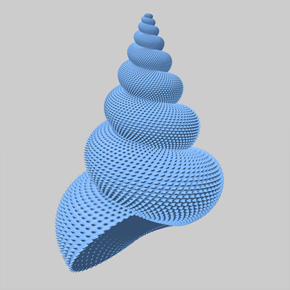
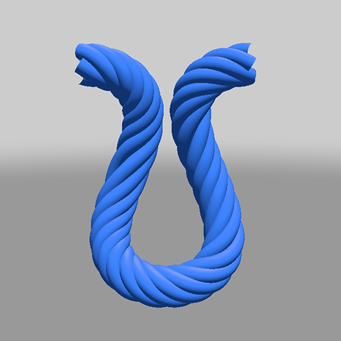
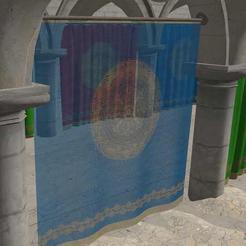
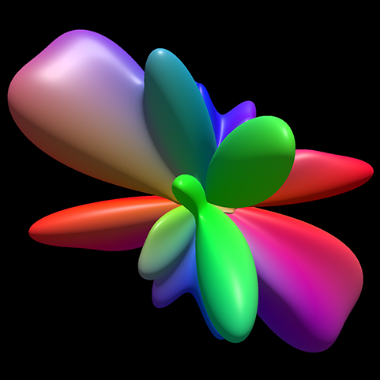

Accompanying source code of our EGPGV 2024 'best' paper:     
**[Fast Rendering of Parametric Objects on Modern GPUs](https://www.cg.tuwien.ac.at/research/publications/2024/unterguggenberger-2024-fropo/)**     
and its extended edition     
**Real-Time Rendering Methods with Adaptive Levels of Detail for Fast Rendering of Parametric Objects on Modern GPUs**     

by Johannes Unterguggenberger¹², Lukas Lipp¹, Michael Wimmer¹, Markus Steinberger²³, Bernhard Kerbl¹, and Markus Schütz¹      

¹ [TU Wien](https://www.tuwien.at/), Institute of Visual Computing & Human-Centered Technology, [Research Unit of Computer Graphics](https://www.cg.tuwien.ac.at/)       
² Huawei Technologies, Austria        
³ Graz University of Technology, Austria     

      
_Figure 1:_ A screenshot of the UI section which allows enabling and disabling of different kinds of parametric objects.

This technique allows fast rendering of various parametrically defined objects like the following:

Parametric Seashell | Parametric Fiber Curves | Curtain of Fiber Curves | Spherical Harmonics (SH) Glyph
:-------------------------:|:-------------------------:|:-------------------------:|:-------------------------:
  |   |   |  
| Parametric description of a seashell model | Parametric description of six intertwined fiber curves | A curtain made of 358k fiber curves, which are rendered fully opaque | SH functions classify as parametric functions; can be used for detailed medical visualization

When the program is run, it will present the window shown in _Figure 1_ in the user interface (UI), which contains controls to enable/disable various parametrically defined objects, along with controls to change their position, and change their rendering method. 
Further settings and information, like the frames per second, can be found in another UI window.
Information about the implementation and the structure of the source code can be found in [our paper](https://www.cg.tuwien.ac.at/research/publications/2024/unterguggenberger-2024-fropo/), in the used framework [Auto-Vk-Toolkit](https://github.com/cg-tuwien/Auto-Vk-Toolkit), in source code comments, and below in section [Hints, Q&A](#hints-qa).

# Setup

**Requirements:**
- Visual Studio 2022
- MSVC C++ compiler
- Vulkan 1.3 or 1.4 SDK with VMA header (optional component => select during SDK install)
- A GPU with at least 3 gigabytes of video memory*

*) Some buffers are pre-allocated, totalling approximately 3 gigabytes. See `MAX_VERTICES` and `MAX_INDICES` in code.

**Setup:**
- Clone this repository
- Pull submodules: `git submodule update --init --recursive`
- Open `FastRenderingOfParametricObjects.sln`
- Select the project `FastRenderingOfPaametricObjects` as the startup project
- Build All and wait for the [Post Build Helper](https://github.com/cg-tuwien/Auto-Vk-Toolkit/tree/master/visual_studio#post-build-helper) to have deployed all the assets
- Debug/Run the solution

# Hints, Q&A

### Important implementation files
Most of the host code is contained in the big huge [`main.cpp`](./host_code/main.cpp) file, which also contains the program entry point.       
Some relevant type definitions are contained in [`types.hpp`](./host_code/types.hpp) and their matching GLSL types are contained in [`types.glsl`](./shader_includes/types.glsl).     
Parametric functions are evaluated on the fly during rendering in the file [`parametric_curve_helpers.glsl`](./shader_includes/parametric_curve_helpers.glsl), most importantly in the function `vec4 paramToWS(float u, float v, int curveIndex, uvec3 userData)`, which calls the different parametric functions implemented in the following files:  
- `vec3 get_plane(float u, float v)` in [`parametric_functions/plane.glsl`](./shader_includes/parametric_functions/plane.glsl)
- `vec3 get_plane(float u, float v)` in [`parametric_functions/palm_tree_trunk.glsl`](./shader_includes/parametric_functions/palm_tree_trunk.glsl)
- `vec3 get_johis_heart(float u, float v)` in [`parametric_functions/johis_heart.glsl`](./shader_includes/parametric_functions/johis_heart.glsl)
- `vec3 get_spiky_heart(float u, float v)` in [`parametric_functions/spiky_heart.glsl`](./shader_includes/parametric_functions/spiky_heart.glsl)
- `vec3 get_sh_glyph(float u, float v, uvec3 userData, int shOrderIndex)` in [`parametric_functions/sh_glyph.glsl`](./shader_includes/parametric_functions/sh_glyph.glsl)
- `vec3 get_yarn_curve(float u, float v, uvec3 userData)` in [`parametric_functions/single_yarn_curve.glsl`](./shader_includes/parametric_functions/single_yarn_curve.glsl)
- `vec3 get_fiber_curve(float u, float v, uvec3 userData)` in [`parametric_functions/single_fiber_curve.glsl`](./shader_includes/parametric_functions/single_fiber_curve.glsl)
- `vec3 get_curtain_yarn(float u, float v, uvec3 userData)` in [`parametric_functions/curtain_yarn_curve.glsl`](./shader_includes/parametric_functions/curtain_yarn_curve.glsl)
- `vec3 get_curtain_fiber(float u, float v, uvec3 userData)` in [`parametric_functions/curtain_fiber_curve.glsl`](./shader_includes/parametric_functions/curtain_fiber_curve.glsl)
- `vec3 get_seashell1(float u, float v)`, `vec3 get_seashell2(float u, float v)`, or `vec3 get_seashell3(float u, float v)` in [`parametric_functions/seashells.glsl`](./shader_includes/parametric_functions/seashells.glsl)
- `vec3 get_giant_worm_body(float u, float v, uvec3 userData, out vec3 pos, out vec3 outward, out vec3 forward)`, `vec3 get_giant_worm_jaws(float u, float v, float offset, float flipStrength, float dragToInnerRadius, uvec3 userData)`, or  `vec3 get_giant_worm_tongue(float u, float v, uvec3 userData)` in [`parametric_functions/giant_worm.glsl`](./shader_includes/parametric_functions/giant_worm.glsl)

### Configuration options in source code
Besides the configuration options which are controllable through the UI, there are several configuration options that can be changed in source files:
The file [`host_device_shared.h`](./shader_includes/host_device_shared.h) is included from both, the C++ side and the GLSL side. It contains several relevant configuration options, which are documented in source code. For example, it contains `MAX_VERTICES` and `MAX_INDICES` which indicate the sizes of pre-allocated buffers. There are also some configuration options at the top of the [`main.cpp`](./host_code/main.cpp) file, like settings for multi sampling or super sampling. Furthermore, some of the GLSL files contain configuration settings which are relevant to the specific file.

### Can more discrete level-of-detail (LOD) meshes be added?
Yes, we have only included six different LODs to save storage in the repository and in GPU memory. More LODs can be added. See `void load_discrete_lods_of_seashells()` in [`main.cpp`](./host_code/main.cpp#L382).

### Where is the SH brain dataset?
For reasons, we could not include the SH brain scan dataset (containing 19,600 SH glyphs) in this repository. Only one single SH glyph is defined directly in source code (see `SH_COEFFS` in  [`parametric_functions/sh_glyph.glsl`](./shader_includes/parametric_functions/sh_glyph.glsl#L22)). Loading of a large dataset from a specific (non-standard) file is implemented in [`big_dataset.cpp`](./host_code/big_dataset.cpp). If you would like to get help with loading and rendering a large data set, please contact the first author via [junt@cg.tuwien.ac.at](mailto:junt@cg.tuwien.ac.at).

